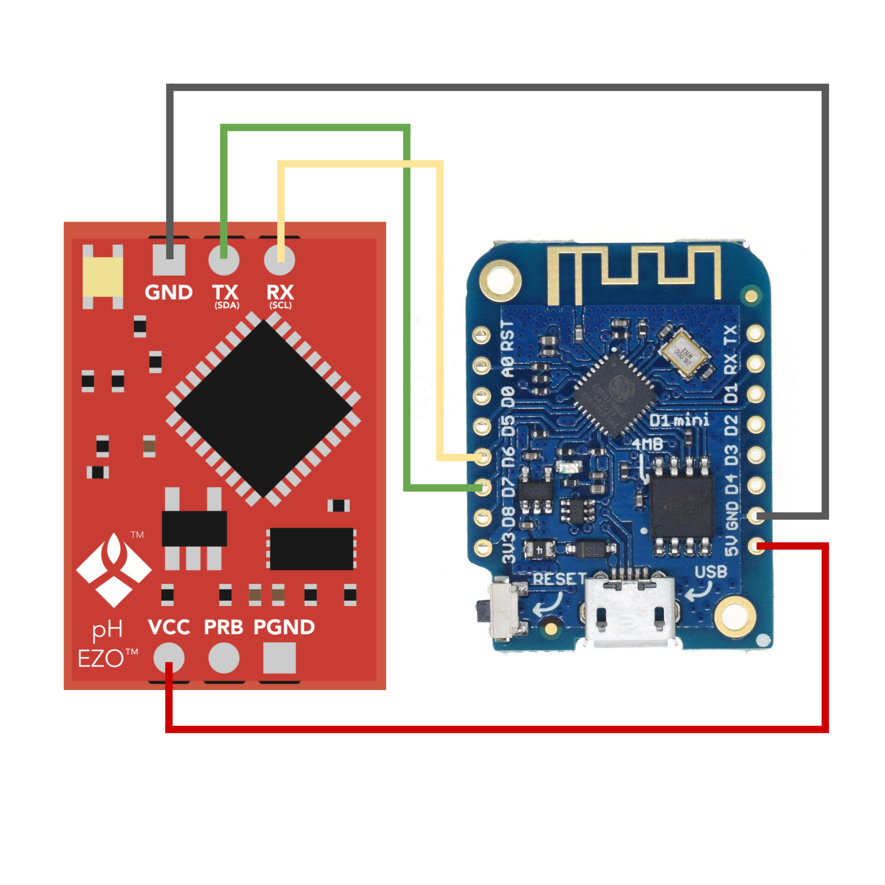

# Atlas Scientific pH Probe Calibration

This project consists of a basic Arduino sketch via [PlatformIO](https://platformio.org) for [Atlas Scientific pH Probes](https://atlas-scientific.com/probes/) which provides interactive UART support to perform tasks such as calibration or setting a temperature offset on the [EZO™ pH circuit](https://atlas-scientific.com/circuits/ezo-ph-circuit/).

## Usage

The following instructions are based on the EZO™ PH circuit connected to a [LOLIN (Wemos) D1 mini board](https://docs.wemos.cc/en/latest/d1/d1_mini.html), or Wemos for short. With minimal changes, it should support other popular ESP8266 and ATmega boards.



1. Connect VCC on the EZO circuit to the 5V pin on the Wemos and the GND pin on the EZO circuit to the GND pin on the Wemos.

2. Connect RX on the EZO circuit to the RX pin on the Wemos (hardware RX).

3. Connect TX on the EZO circuit to the D7 on the Wemos (GPIO 13).

4. Plug your EZO circuit with the pH Probe connected and check the name of the USB TTL device using `ls /dev/tty.*` (e.g. `/dev/tty.wchusbserial1420`).

5. Compile sketch and upload it:

   ```
   pio run  -e wemos-d1mini -t upload --upload-port=/dev/tty.wchusbserial1420
   ```

6. Enter serial monitor:

    ```
    pio device monitor --eol CR
    ```

    Then select the appropriate device from the list.

By default, the EZO pH circuit is in continuous read mode and reports one reading per second.

### Interactive Mode

The serial device monitor gives you interactive access to the UART protocol supportedby the EZO pH Circuit.

You can enter commands directly on the serial monitor (e.g. type "i" and then hit return). Note that entered text (i.e. what you type) is not directly visible on the console, but the command will still be accepted.

Type `I`, hit return and then the output should be:

```
?I,pH,2.12
*OK
```

### Calibration

The EZO pH circuit supports multiple calibration forms (1, 2 and 3 point calibration), depending on the accuracy that is being sought for the pH probe.

The following example works for all forms since they are considered additive (1 point calibration is mid point, 2 point calibration is mid point followed by low point and 3 point calibration is mid, followed by low, followed by high point calibration).

To calibrate using three points, start by checking the temperature offset by typing `T,?`:

```
?T,25.00 <cr>
*OK <cr>
```

Adjust the temperature offset compensation (where 19.5 ºC, in this example, is the temperature of the solution) by issuing the following command:

```
T,19.5
```

Next, put the pH probe in mid pH solution (pH 7). Let it stabilize for 1 or 2 minutes by looking at the readings on the serial monitor and then issue the command:

```
Cal,mid,7.00
```

(Optional, 2 point calibration) Next, put the pH probe in low pH solution (pH 4). Repeat the stabilization steps and then issue the command:

```
Cal,mid,4.00
```

(Optional, 3 point calibration) Next, put the pH probe in high pH solution (pH 10). Repeat the stabilization steps and then issue the command:

```
Cal,mid,10.00
```

Done!

If you'd like to store the calibration data, you may do so by exporting the stored calibration values: Issue the command:

```
Export,?
```

The following result indicates 4 strings of up to 12 chars long each:

```
?EXPORT,4,46
*OK
```

To retrieve each string, issue the command `Export` multiple times until `*DONE` is output to the console, signaling all data has been exported:

```
Export
00EF44593CC3
*OK
Export
C040C3010101
*OK
Export
00804000E040
*OK
Export
00204117E4
*OK
Export
*OK
*DONE
```

Keep in mind that every time a mid point calibration command is issued, calibration data gets erased and the process has to be restarted.

Finally, probes should perform very accurately within their first year of usage, after which it is recommended to re-calibrate it every six months, depending on the use case.

## License

MIT
